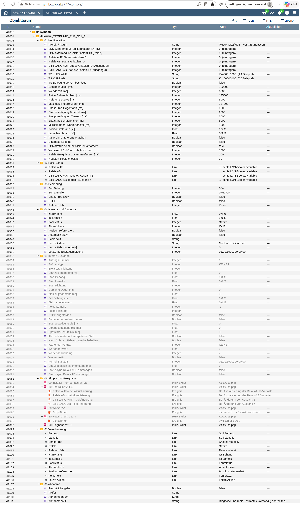

# Symcon LCN Jalousie

GitHub-fertige Modulbibliothek für **Symcon 9.0**. Eine Modulinstanz legt den vollständigen V11.3-Objektbaum, die Variablen, Skripte, Ereignisse und Links automatisch an. Der Benutzer wählt im Modulmenü nur die vorhandenen LCN-Instanzen und Statusvariablen aus und trägt die gemessenen Zeiten sowie die bestätigten TS-Datenfelder ein.

> **Sicherheitsprinzip:** Die gegenseitige Verriegelung der Motorrelais und die lokale Bedienung bleiben zwingend in LCN-PRO. Das Symcon-Modul sendet nur virtuelle KURZ-Tastenbefehle und wertet reale Relaisrückmeldungen aus.

## Enthaltene Module

- **LCN Jalousie** – eine Instanz pro Jalousie
- **LCN Jalousie Konfigurator** – komfortables Anlegen weiterer Instanzen

## Repository-Struktur

Die beiden Modulordner liegen **direkt im Hauptverzeichnis** des Repositorys. Symcon behandelt jeden normalen Ordner im Hauptverzeichnis als mögliches Modul. Deshalb darf es keinen Sammelordner `modules` geben.

```text
SymconLCNJalousie/
├─ library.json
├─ LCNJalousie/
│  ├─ module.json
│  └─ module.php
├─ LCNJalousieKonfigurator/
│  ├─ module.json
│  └─ module.php
├─ docs/
├─ tests/
└─ .github/
```

## Mindestvoraussetzungen

- Symcon 9.0
- eingerichtete LCN-Verbindung in Symcon
- vorhandene LCN-Modulinstanzen für Sendemodul und Aktor
- vier echte Boolean-Statusvariablen: Relais AUF, Relais ZU, GT8 LANG AUF, GT8 LANG ZU. Die GT8-LANG-Variablen dürfen von beliebigen freien UPU-Ausgängen 3/4 stammen.
- geprüfte LCN-PRO-Verriegelung
- mit PCHK/LCN-Busmonitor bestätigte TS-Datenfelder

### Freie Wahl der simulierten GT8-LANG-Ausgänge

Die Statusvariablen für GT8 LANG AUF/ZU müssen nicht vom Haupt-UPU des GT8, vom TS-Sendemodul oder vom Relaisaktor stammen. Ausgang 3 beziehungsweise 4 darf auf einem beliebigen freien LCN-UPU liegen. Entscheidend ist die LCN-PRO-Programmierung: Der fremde simulierte Ausgang muss als **zweites Ziel der korrekten GT8-Taste am Haupt-UPU** eingetragen sein. Das Modul prüft deshalb nur Variablentyp und Eindeutigkeit, nicht die Zugehörigkeit zum TS-Sendemodul.

## Installation

1. Repository öffentlich auf GitHub veröffentlichen.
2. In Symcon **Kern Instanzen → Modules** öffnen.
3. Über **+** die Repository-URL eintragen: `https://github.com/DEIN-BENUTZERNAME/SymconLCNJalousie.git`
4. Instanz **LCN Jalousie Konfigurator** hinzufügen.
5. Im Konfigurator eine neue **LCN Jalousie** anlegen.
6. Alle Pflichtfelder der Jalousieinstanz ausfüllen und **Übernehmen** wählen.

Eine ausführliche Anleitung steht in [ERSTE_SCHRITTE.md](ERSTE_SCHRITTE.md).

## Objektbaum



## Entwicklungsstand

**0.1.15 – öffentliche Beta.** Der Runtime-Kern basiert auf der tiefengeprüften V11.3-Skriptfassung. Das Modul automatisiert deren Aufbau und Konfiguration. Vor einem produktiven Motorbetrieb bleiben reale Tests mit Symcon 9.0, PCHK/PCK, LCN-Bus, Relais, Motor und Endlagen zwingend.

## Lizenz

MIT – siehe [LICENSE](LICENSE).
## Eigene Symcon-Kachel und Referenzierung

Ab Version 0.1.11 nutzt die Geräteinstanz das offizielle Symcon HTML-SDK für eine eigene, interaktive Jalousiekachel. Behang und Lamellen sind identisch aufgebaut: links drei gleich große runde Tasten, mittig eine dynamische grafische Statusanzeige und rechts ein vertikaler Slider. Beim Behang lauten die Tasten `AUF`, `STOP`, `ZU`; bei den Lamellen `AUF`, `MITTE`, `ZU`. Beide Slider zeigen 0 % oben und 100 % unten. Der kompakte Laufstatus und der Schalter **ShakeFree nach Endlage ZU** bleiben sichtbar. Der optische Tastenkranz kennzeichnet nur einen laufenden Auftrag und verschwindet nach dessen Abschluss automatisch. Die Kachel verwendet Symcon-Icons über `/icons.js`, übernimmt Akzent-, Text- und Kartenfarbe direkt aus der geöffneten Symcon-Visualisierung und sendet Benutzeraktionen ausschließlich über `requestAction()` an die Modulinstanz.

Die direkten Statusvariablen `Position`, `Drehgrad` und `Position gültig` bleiben erhalten, damit die Werte auch in der Listenansicht und für Automationen verfügbar sind. `Position` verwendet 0 % = vollständig offen und 100 % = vollständig geschlossen; `Drehgrad` verwendet 0 % in AUF-Richtung und 100 % in AB-Richtung.

Ab Version 0.1.15 wird eine gültige Endlagenreferenz doppelt persistent gespeichert: als sichtbare Statusvariable und zusätzlich als Modulattribut. Ein normales **Übernehmen**, ein Objektbaum-Rebuild oder eine erneute Statusabfrage löscht sie deshalb nicht mehr. Die Diagnosevariablen `Letzte Referenz-Endlage` und `Letzte Referenzierung` zeigen, wann 0 % AUF beziehungsweise 100 % ZU zuletzt sicher gesetzt wurden. Eine Referenz wird weiterhin bewusst verworfen, wenn das Bewegungsmodell geändert wird, die Symcon-Steuerung deaktiviert wird oder eine Fehlerverriegelung eintritt.

Ist `Position gültig` noch `false`, wird der erste Endlagenauftrag auf 0 % oder 100 % automatisch als vollständige Referenzfahrt ausgeführt. Die Dauer ist jetzt richtungsspezifisch: Gesamtzeit 100→0 beziehungsweise 0→100 plus Referenzreserve, begrenzt durch `MaxFahrt`. Nach Ablauf der Reserve wird die entsprechende Endlage als Referenz gespeichert. Bei 100 % ZU läuft danach zusätzlich das konfigurierte Kalibrierfenster; bei 0 % AUF wird sofort der richtungsabhängige STOP ausgelöst. Lokale/externe Fahrten werden verfolgt, setzen aber ohne eindeutig überwachten Symcon-Endlagenauftrag keine neue Referenz.

Der STOP-Taster der Kachel ist kein separater LCN-STOP-Befehl. Der Controller wertet die realen Relaisrückmeldungen aus und sendet den KURZ-Befehl der tatsächlich aktiven Richtung erneut, sodass das aktive LCN-Relais ausgeschaltet wird.


## Symcon-Themefarben

Die HTML-Kachel übernimmt Akzent-, Text- und Kartenfarbe direkt aus `--accent-color`, `--content-color` und `--card-color` der jeweils geöffneten Symcon-Visualisierung. Betriebssystem- oder Browser-Dark-Mode werden nicht separat ausgewertet.


## Kalibrierfenster, Aktivschalter und Fehlerverriegelung

Ab Version 0.1.13 besitzt jede Instanz die Eigenschaft **Symcon-Steuerung aktiv**. Wird sie ausgeschaltet, deaktiviert das Modul seine Ereignisse und Timer und sendet keine LCN-Befehle; die lokale LCN-Bedienung bleibt verfügbar.

Nach einer vollständig von Symcon ausgeführten ZU-Fahrt auf 100 % bleibt die ZU-Ansteuerung für die eingestellte **Zeitverzögerung / das Kalibrierfenster** (Vorgabe 30 Sekunden) unverändert aktiv. Währenddessen sendet Symcon keinen automatischen STOP und keinen Gegenbefehl. Erst nach Ablauf wird die ZU-Ansteuerung beendet. Ist **ShakeFree nach Endlage ZU** eingeschaltet, folgt die Gegenfahrt erst danach. Die Zeitverzögerung läuft auch bei ausgeschaltetem ShakeFree und gibt einer im Antrieb autonom gestarteten Endlagen-/Seilspannungsprüfung ein ungestörtes Zeitfenster.

## Richtungsabhängige Laufzeiten

Die beiden vollständigen Fahrtrichtungen werden getrennt konfiguriert:

- **Gesamtlaufzeit 0 % AUF → 100 % ZU**: vollständige Schließfahrt ab oberer Endlage.
- **Gesamtlaufzeit 100 % ZU → 0 % AUF**: vollständige Öffnungsfahrt einschließlich der vollen Lamellenwendung.

Für Zwischenpositionen leitet das Modul daraus zwei unterschiedliche Behanggeschwindigkeiten ab. In Richtung AUF wird die volle Wendezeit von der konfigurierten Gesamtzeit 100→0 abgezogen; in Richtung ZU wird die konfigurierte Gesamtzeit 0→100 direkt als reine Behanglaufzeit verwendet. Sanftanlauf und Rest-Wendezeit werden anschließend abhängig vom tatsächlichen Startzustand zusätzlich berücksichtigt.

Bei einem Laufzeit- oder Aufbaufehler verriegelt sich die Instanz. Alle Modulereignisse und Timer werden deaktiviert und es werden keine weiteren LCN-Befehle gesendet. Die lokale LCN-Steuerung bleibt frei. Eine Quittierung ist erst möglich, wenn beide realen Relais AUS melden; die Quittierung selbst sendet keinen Motorbefehl und macht die Positionsreferenz vorsorglich ungültig.

Jeder automatische Endlagen- und ShakeFree-Ablauf besitzt einen eindeutigen Relais-AUS-Abschluss. Nach dem 30-s-Kalibrierfenster wird ZU einmal gestoppt und das reale Ausschalten beider Relais abgewartet. Bei aktivem ShakeFree folgt danach AUF für die konfigurierte Gegenfahrzeit, erneut STOP und anschließend der Lamellen-ZU-Nachlauf. Auch dieser Nachlauf wird nach der berechneten Wendezeit gestoppt. Erst nach real bestätigtem Relais-AUS geht der Ablauf in Ruhe. Der zyklische Healthcheck (Vorgabe 10 s) dient als zweite Deadline-Sicherung, falls der 1-s-Worker ausfällt. Bleibt ein Relais trotz einmaligem STOP aktiv, verriegelt sich die Instanz; ein zweites automatisches Toggle wird bewusst nicht gesendet.
